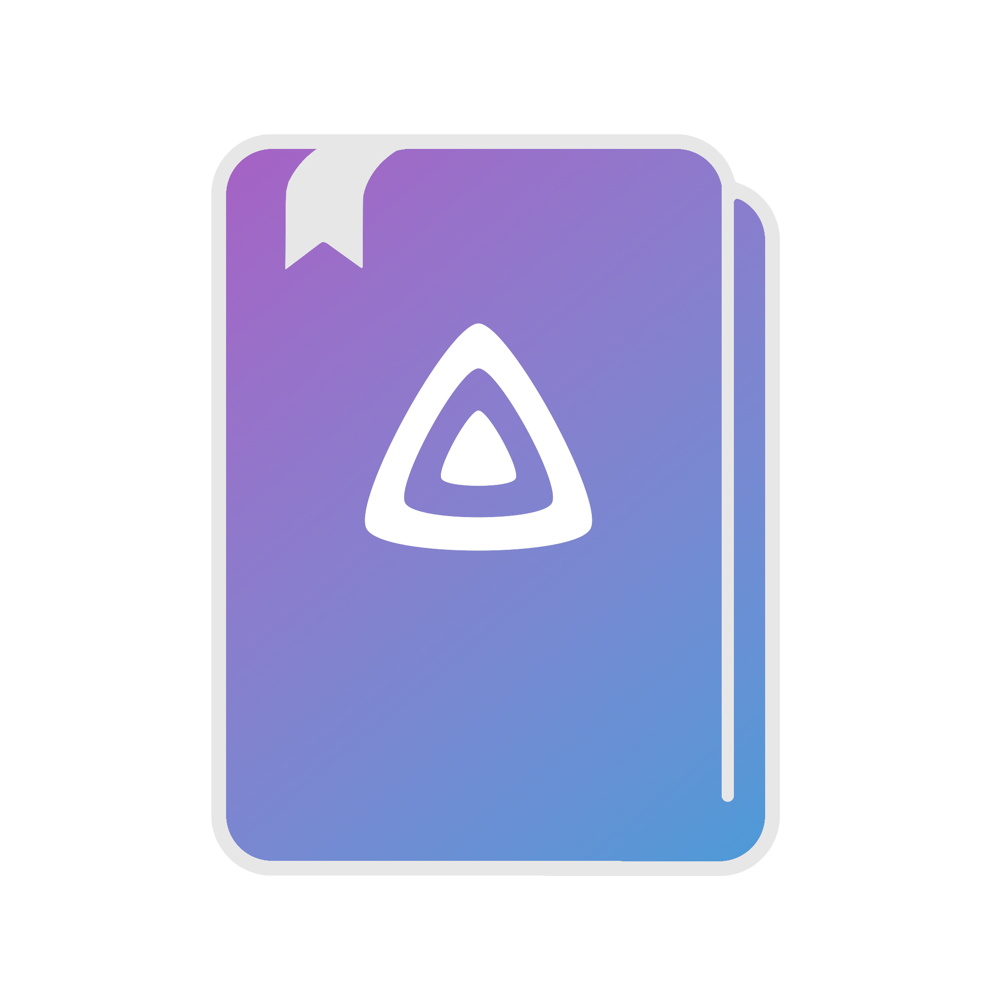

<h1 align="center">JellyBook</h1>
<h3 align="center">A book a comic reading app for Jellyfin</h3>

  
  
  

  

  Hi, this is a passion project I am working on.
  Its a app thats meant to allow you to read your files from Jellyfin on mobile.
  It is in a state where I do beleive it's useable for most comic reading and some books but it still has a long way to go.

## :zap: Ways to Downloading:
| Platform | Link |
| :------: | :--: |
| **iOS** |  |
| **Android** | Download the latest release for your current platform from the releases. It will at some point be added to the Google Play store and the F-Droid store. |

 

## :file_folder: File formats:
| Format | Known Issues / Planned Features | Specification(s) |
| :----- | :---------- | :------------ |
| `.cbr` & `.rar` | <ul><li>**cbr is a proprietary file format so is not necessarily encouraged**</li><li>cbr files don't support streaming yet.</li><li>The library is using depricated functions</li><li>The view for them currently only supports horizontal scroll</li><li>The view for them currently does not show a progress indicator</li></ul> | <ul><li>[CBR/RAR](https://www.rarlab.com/technote.htm)</li></ul> |
| `.cbz` & `.zip` | <ul><li>cbz files don't support streaming yet.</li><li>The view for them currently only supports horizontal scrolling</li><li>The view for them currently does nto show a progress indicator | <ul><li>[CBZ/ZIP](http://www.idea2ic.com/File_Formats/ZIP%20File%20Format%20Specification.pdf)</li></ul> |
| `.pdf` | <ul><li>Sometimes gives a error that it isn't downloaded even when it is</li><li>Only supports horizontal scrolling currently</li><li>No progress bar currently</li></ul> | <ul><li>[ISO 32000-1:2008(en)](https://www.iso.org/obp/ui/#iso:std:iso:32000:-1:ed-1:v1:en)</li><li>[ISO 32000-2:2020(en)](https://www.iso.org/obp/ui/#iso:std:iso:32000:-2:ed-2:v1:en)</li></ul> | 
| `.epub` | <ul><li>Image support is not the greatest</li><li>No horizontal support yet</li><li>Just not in a state where'd I consider the support proper</li></ul> | <ul><li>[EPUB 3.2](https://www.w3.org/publishing/epub3/epub-spec.html) |

 

| <h1> Currently Unsupported Filetypes </h1> |
| :-- |
| <ul><li>`.cbt`/`.tar`<li>`.cba`/`.ACE`</li><li>`.cb7`/`.7z`</li><li>`tar.gz`</li><li>`.WebP`</li><li>`.gif`</li><li>`.lrf`/`.lrx`</li><li>`.djvu`</li><li>`.pdb`</li><li>`.fb2`</li><li>`.ibooks`</li><li>`.azw`/`.azw3`/`.kf8`/`.kfx`</li><li>`.pcf`/`.mobi`</li><li>`.opf`</li><li>`.txt`</li><li>`.oxps`/`.xps`</li></ul> |
| <h2> Currently Unsupported Audiobooks Filetypes </h2> |
| <ul><li>`.mp3`</li><li>`.aax`</li><li>`.m4a`/`.m4b`</li><li>`.aac`</li><li>`.ogg`</li><li>`.flac`</li><li>`.wav`</li></ul>

## :construction: Todo:
 - [ ] Vertical scrolling
 - [ ] Audiobooks
 - [ ] Have a more universal experience between the rest of the formats and pdfs (pdf work a bit differently)
 - [ ] Allow local caching of current files and still able to browse what books in collection when offline (proper offline support)
 - [ ] Remember user support
 - [ ] Multiple server support
 - [ ] Settings page
 - [ ] For the download completed screen I want to add a image or gif of a jellyfish reading a book (credit to thornbill on the Matrix server for that idea)
 - [ ] UI Overhall in several areas of the app (will keep current as options for those who want it)
        - [ ] Part of the current issue is that it looks like a Android app made in Flutter which although it is made in Flutter, I want it to have a more cross platform feel to it
 - [ ] background download
 - [ ] Publish to several stores

## :warning: Known Issues
 - Due to the re-working of several components, you may need to reset the apps data after upgrading so that it still functions as intended
 - Weslate features are not currently implimented

## :telephone_receiver: Contact Me
 - Discord: `kmp3e#9430`
 - Matrix: `@kmp3e:matrix.org`
 - Feel free to submit a issue on GitHub
 
## ⚙️ Contributing:
 - Check out our wiki: [Here](https://github.com/Kara-Zor-El/JellyBook/wiki)
 - Check out our weblate instance to help translate: [Here](https://hosted.weblate.org/projects/JellyBook/jellybook-app/)

## 📚 Translating:

## 🎉 Special Thanks:
 - Thank you to u/anekdotos on Reddit for donating to the project so it could be published on iOS
 - Thank you to Weblate for hosting translation
