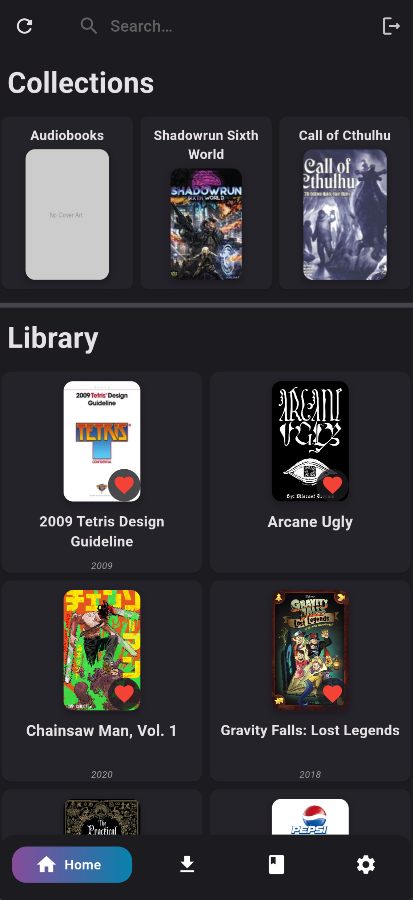
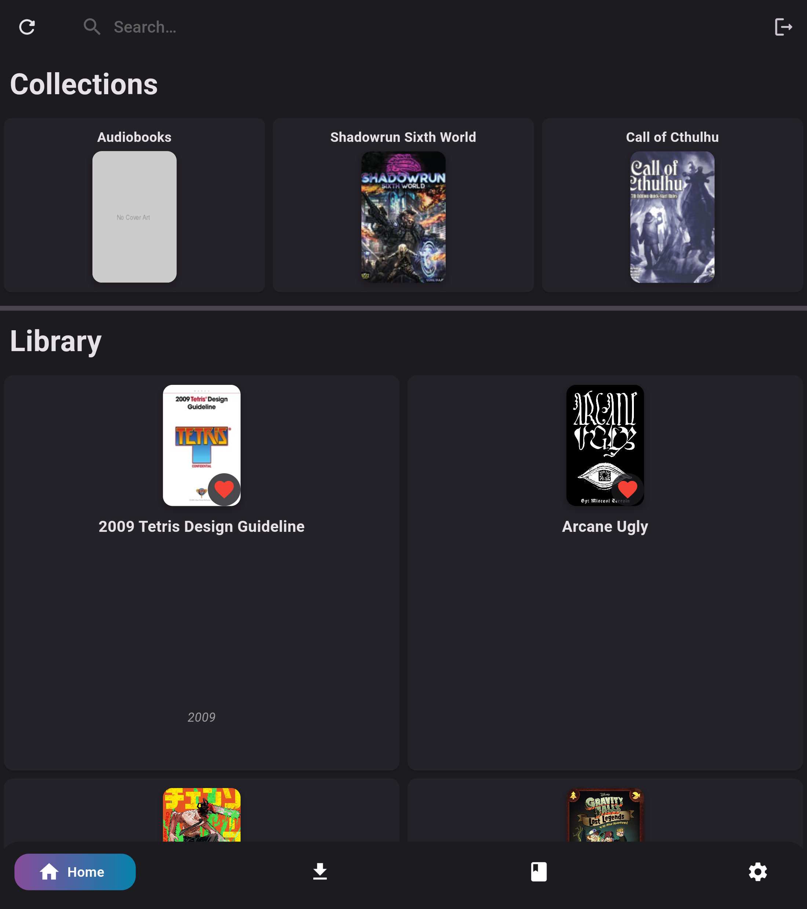
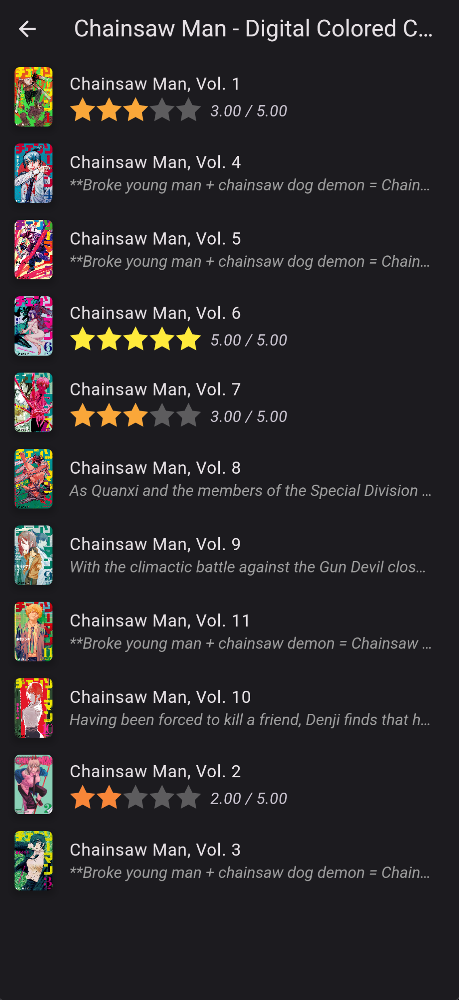
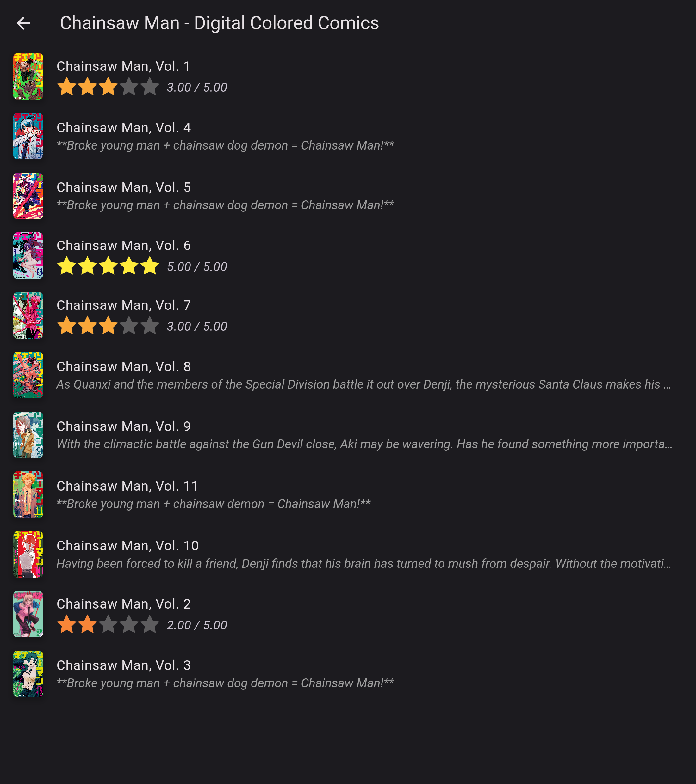
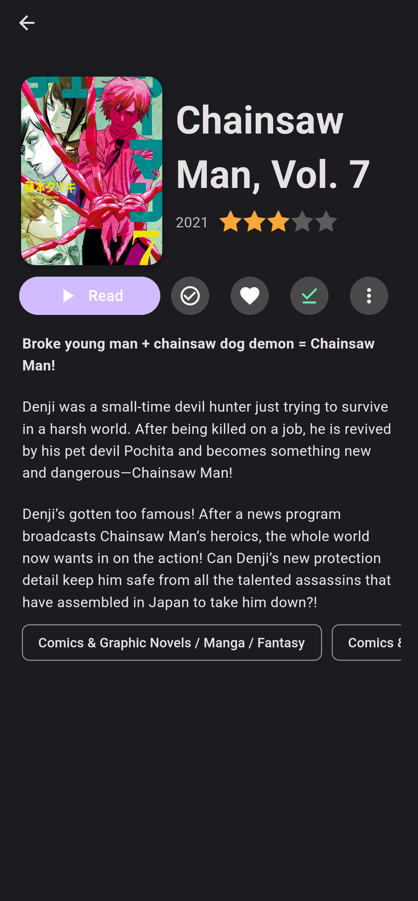
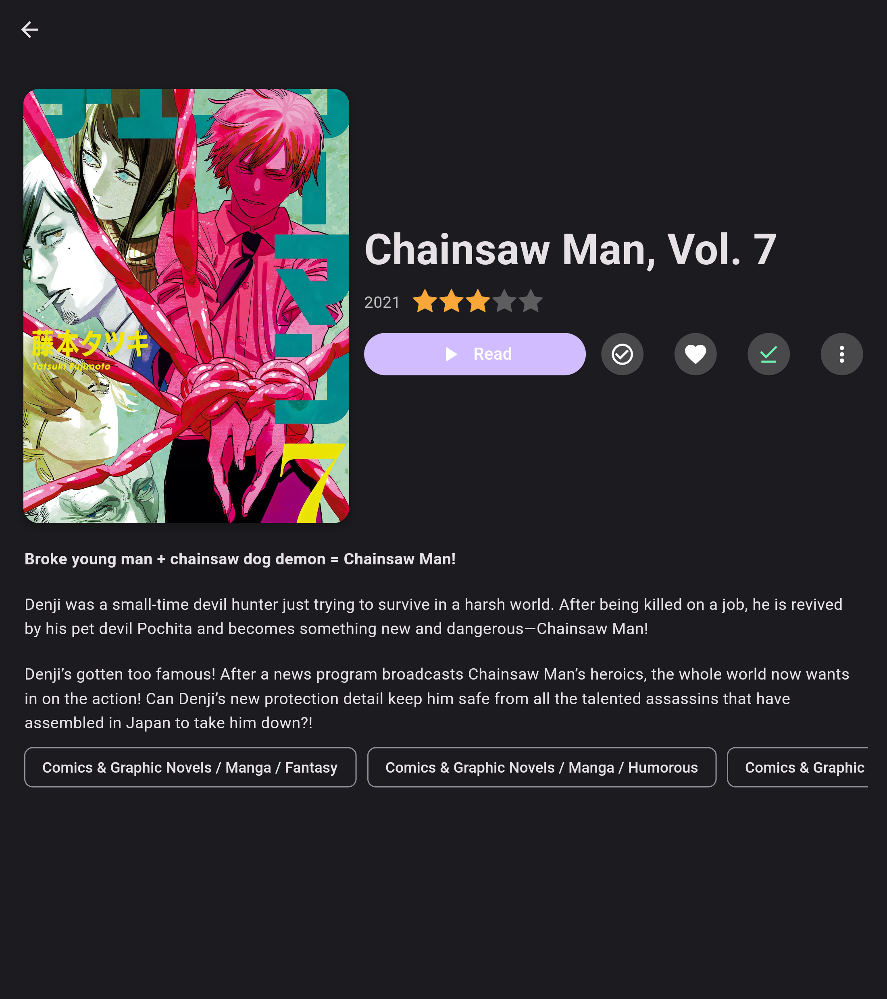
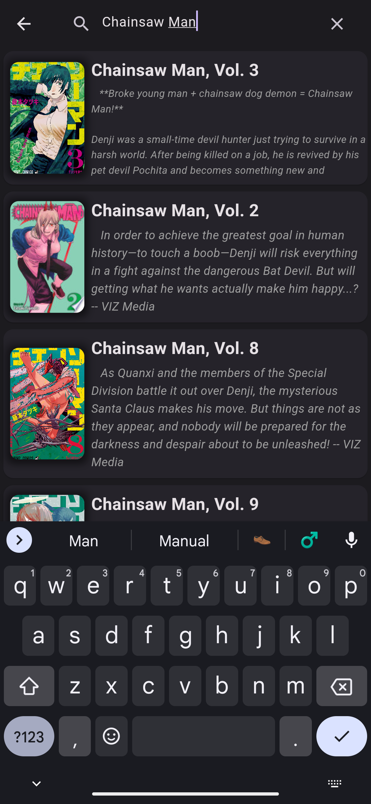
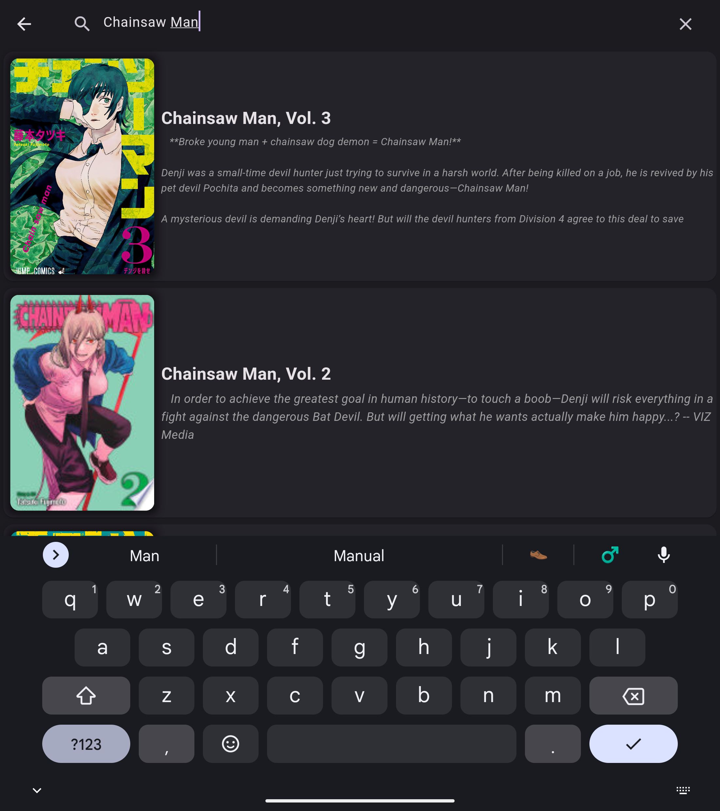

<h1 align="center">JellyBook</h1>
<h3 align="center">A book and comic reader for Jellyfin</h3>

  
  
  

  

  Hi, this is a passion project I am working on.
  Its an app that's meant to allow you to read ebooks, comics, and listen to audiobooks from your Jellyfin server.

<h1>Table of Contents</h1>

   * [⚡ Installation:](#zap-installation)
   * [📷 Screenshots (and videos):](#camera-screenshots-and-videos)
   * [📁 File formats:](#file_folder-file-formats)
      * [🎵 Audiobook formats:](#musical_note-audiobook-formats)
   * [ Currently Unsupported Filetypes ](#-currently-unsupported-filetypes-)
   * [ Currently Unsupported Audiobooks Filetypes ](#-currently-unsupported-audiobooks-filetypes-)
   * [🚧 Todo:](#construction-todo)
   * [📞 Contact Me](#telephone_receiver-contact-me)
   * [⚙️ Contributing:](#️-contributing)
   * [📚 Translating:](#-translating)
   * [🎉 Special Thanks:](#-special-thanks)
   * [🤔 Why is Development so Slow?](#-why-is-development-so-slow)

## :zap: Installation:
| Platform | Link |
| :------: | :--: |
| **iOS** |  |
| **Google Play and Galaxy Store** | Download the latest release for your current platform from the releases. It will at some point be added to the Google Play store and may be added to the Galaxy Store |
| **F-Droid** | 
Soon to be submitted to the F-Droid store
 |
| **Other Platforms** | If you would like to see this app on your platform, please open an issue and I will see what I can do. |

 

## :camera: Screenshots (and videos):

Click to expand

| Screen | Images (Phone) | Images (Tablet) |
| :---------------: | :--------------------: | :---------: |
| Library Screen |  |  |
| Collection Screen |  |  |
| Book Info Screen |  |  |
| Search Screen |  |  |

## :file_folder: File formats:
| Format | Known Issues / Planned Features | Specification(s) |
| :----- | :---------- | :------------ |
| `.cbr` & `.rar` | <ul><li>**CBR is a proprietary file format so is not necessarily encouraged.**</li><li>CBR files don't support streaming yet.</li><li>The library is using deprecated functions.</li><li>The view for them currently does not show a progress indicator.</li></ul> | <ul><li>[CBR/RAR](https://www.rarlab.com/technote.htm)</li></ul> |
| `.cbz` & `.zip` | <ul><li>The view for them currently does not show a progress indicator. | <ul><li>[CBZ/ZIP](http://www.idea2ic.com/File_Formats/ZIP%20File%20Format%20Specification.pdf)</li></ul> |
| `.pdf` | <ul><li>Sometimes throws an error that the content isn't downloaded even when it is.</li><li>Only supports horizontal scrolling currently.</li><li>No progress bar currently.</li></ul> | <ul><li>[ISO 32000-1:2008(en)](https://www.iso.org/obp/ui/#iso:std:iso:32000:-1:ed-1:v1:en)</li><li>[ISO 32000-2:2020(en)](https://www.iso.org/obp/ui/#iso:std:iso:32000:-2:ed-2:v1:en)</li></ul> | 
| `.epub` | <ul><li>Image support is not the greatest.</li><li>No horizontal support yet.</li><li>Just not in a state where I'd consider the support proper.</li></ul> | <ul><li>[EPUB 3.2](https://www.w3.org/publishing/epub3/epub-spec.html) |
### :musical_note: Audiobook formats:
- Currently, the app supports the following formats:
  - `flac`
  - `mpga`
  - `mp3`
  - `m3u`
  - `m3u8`
  - `m4a`
  - `m4b`
  - `wav`
 

> Note: this is partially due to the fact that [Jellyfin Bookshelf Plugin](https://github.com/jellyfin/jellyfin-plugin-bookshelf) only currently supports `epub`, `mobi`, `pdf`, `cbz`, and `cbr` for books and `mp3`, `m4a`, `m4b`, and `flac` for audiobooks. I am unsure if other formats can be added here until the plugin is updated.

| <h2> Currently Unsupported Filetypes </h2> |
| :-- |
| <ul><li>`.cbt`/`.tar`<li>`.cba`/`.ACE`</li><li>`.cb7`/`.7z`</li><li>`tar.gz`</li><li>`.WebP`</li><li>`.gif`</li><li>`.lrf`/`.lrx`</li><li>`.djvu`</li><li>`.pdb`</li><li>`.fb2`</li><li>`.ibooks`</li><li>`.azw`/`.azw3`/`.kf8`/`.kfx`</li><li>`.pcf`/`.mobi`</li><li>`.opf`</li><li>`.txt`</li><li>`.oxps`/`.xps`</li></ul> |
| <h2> Currently Unsupported Audiobooks Filetypes </h2> |
| <ul><li>`.aax`</li><li>`.aac`</li><li>`.ogg`</li></ul>

## :construction: Todo:
 - [ ] A more consistent experience between all book formats
 - [ ] Redesign several screens to give them a more cross-platform and polished feel
 - [ ] Multiple server support
 - [ ] For the download completed screen I want to add a image or GIF of a jellyfish reading a book (credit to thornbill on the Matrix server for that idea)
 - [ ] UI overhaul in several areas of the app (will keep current as options for those who want it)
    - Part of the current issue is that it looks like an Android app made in Flutter; although it is made in Flutter, I want it to have a more cross-platform feel to it
    - I also want to make it more visually appealing (I am a programmer, not a designer and would love some help with this)
 - [ ] Background download
 - [ ] Publish to several stores
 - [ ] Proper code documentation
 - [ ] Proper testing (unit, integration, and widget... I have very little experience with this)
 - [ ] Full code restructuring and refactoring
 - [ ] Use [Tentacle](https://github.com/jmshrv/finamp/discussions/480) as new API client (must work on this first)
 - [ ] Add a proper page on IzzyOnDroid using fastlane (see [here](https://github.com/JellyBookOrg/JellyBook/issues/107#issuecomment-1714632725))
 - [ ] Add dynamic loading of books on library view to prevent slowdowns
 - [ ] Allow user to edit metadata of books (both locally and on the server)
 - [X] Vertical scrolling
 - [X] Audiobooks
 - [X] Allow local caching of current files while viewing collection when offline (proper offline support)
 - [X] Remember user support
 - [X] Settings page

## :telephone_receiver: Contact Me
 - Discord: `kmp3e`
 - Matrix: `@kmp3e:matrix.org`
 - Email: mailto:kara.wilson.2005.08@gmail.com
 - Feel free to submit an issue on GitHub
 
## ⚙️ Contributing:
 - [Check out our wiki here](https://github.com/Kara-Zor-El/JellyBook/wiki)
 - [Check out our Weblate instance to help translate](https://hosted.weblate.org/projects/JellyBook/jellybook-app/)
 - Add features mentioned in [Todo](JellyBook#construction-todo)
 - Take a look at the sponsors sections and help sponsor this project :)

## 📚 Translating:

## 🎉 Special Thanks:
 - Thank you to [u/anekdotos](https://reddit.com/u/anekdotos) on Reddit for donating to the project so it could be published on iOS
 - Thank you to Weblate for hosting translation
 - Thank you to IzzyOnDroid for packaging and hosting the app on their repo
 - Shout outs to my girlfriend https://github.com/tarbaII for always supporting me and helping me manage issues on occasion

## 🤔 Why is Development so Slow?
- I am a full time student and work part time. I recently had midterms come up which caused me to have to slow down on my working on this project. This project is really fun to work on for me but that being said, without making any money from it or receiving any donations my ability to work on this project is hindered. This is since I do need money to help pay for my education and living expenses. I would really love to be able to work on open source full time but unfortunately that is not possible at this current time to work on it like how I was previously.
- That all being said, I do also have a tendency to burn out a lot when going at the rate I was going when I started this project so have tried to slow down to a pace where I'm ensuring I don't burn out and slowly over time plan to increase my frequency of working on this project to a place more close to where it was previously.
